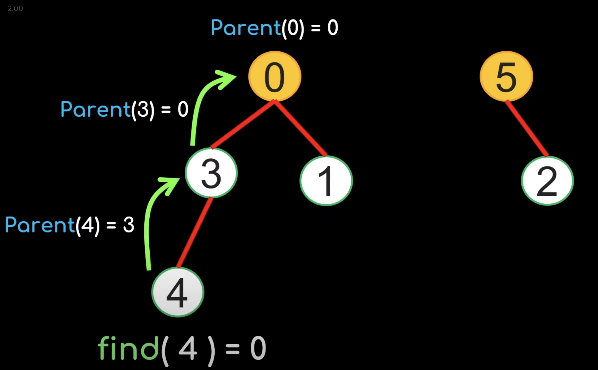

Union-find
==========
- 다른 이름으로 disjoint set 자료구조라고 함
- MST 알고리즘인 `kruskal's algorithm`에서 중요하게 쓰임
- 전체 그룹을 대표하는 `representative` 노드를 설정한다. 이걸로 두 노드가 같은 그룹에 속하는지 판단  
  (x, y belongs to same group iff x, y have same representative)
- `representative`를 root로 하는 트리로 만들어서 구현
  
  


x가 속한 그룹과 y가 속한 그룹 합쳐주기
```
union(x,y)
```

x가 속한 그룹 찾기 -> 해당 그룹의 representative를 리턴
```
find(x)
``` 

### pseudo code

초기화 -> 모든 노드의 parent는 자기 자신으로
```
parent[i] = i
```

find -> 루트면 리턴, 아니면 계속 부모 찾아 올라가기
```python
def find(x):
    if parent[x] == x:
        return x
    else find(parent[x])
```


union
```python
def union(x,y):
    parent[find(x)] = find(y)
```

